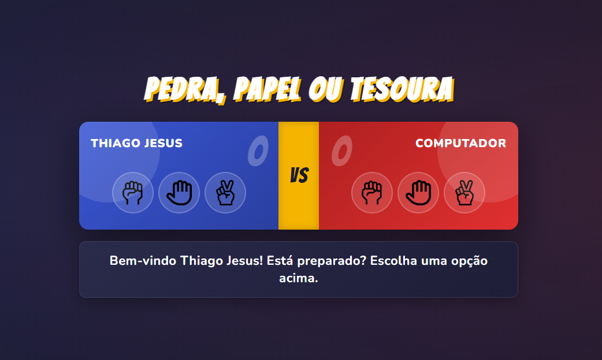
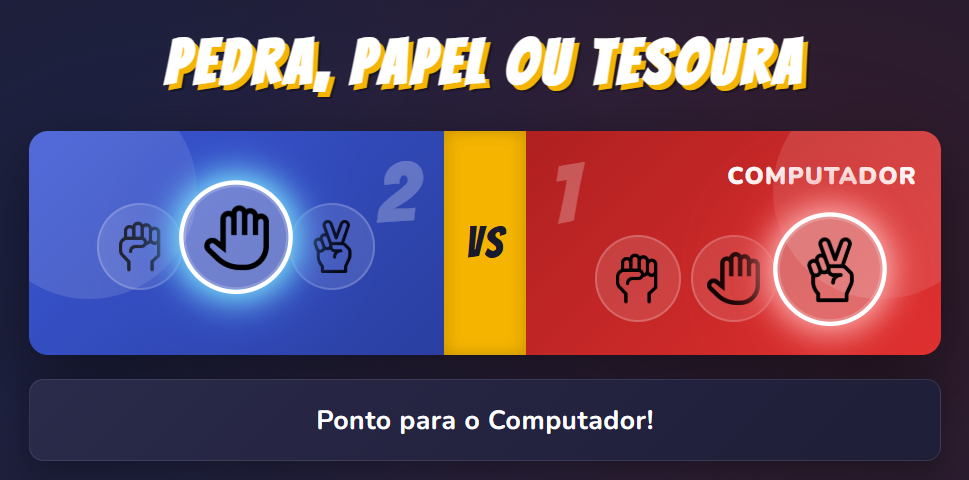

# ✊ Jokenpô (Pedra, Papel ou Tesoura) - Animated Edition

## 📝 Descrição do Projeto 

Aplicação interativa de **"Pedra, Papel ou Tesoura"** com foco em **experiência do usuário e animações**. O projeto transforma a lógica clássica em um duelo visual dinâmico com feedbacks em tempo real.

## ✨ Destaques
* **Animações de Confronto:** Movimentação fluida dos ícones durante a disputa.
* **Glow dinâmico:** Efeitos de iluminação nos itens selecionados (Neon Blue vs White).
* **UI Responsiva:** Interface moderna com Dark Mode e placar interativo.
* **Sincronização:** Lógica de vitória vinculada ao tempo das transições CSS.

## 🚀 Tecnologias
* **HTML5** (Semântica)
* **CSS3** (Keyframes & Flexbox)
* **JavaScript** (Lógica & Manipulação de DOM)

## 🕹️ Como Jogar
1. Clique em **Pedra, Papel ou Tesoura** no painel azul.
2. Aguarde a **animação de confronto** com o computador.
3. O resultado surgirá no rodapé e o placar será atualizado automaticamente.

---

Feito com ❤️ por **Thiago Jesus**
